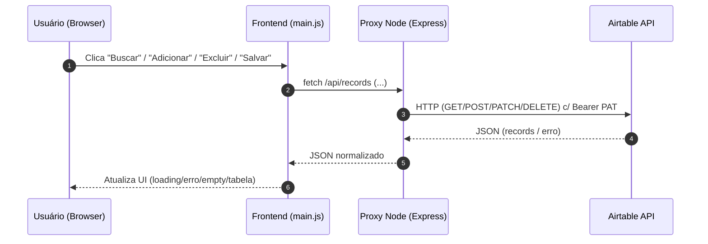

# 🧩 Missão 5 – CloudConnect

Web app simples (cadastro de **Clientes**) com **CRUD** em Airtable via **Node proxy** + frontend em HTML/CSS/JS.

> **Por que proxy?** Colocar o token diretamente no frontend expõe sua credencial. O proxy Node (servidor) mantém o token no backend (variáveis de ambiente), atendendo aos requisitos de **segurança**.


## ✨ Funcionalidades

- **Listar** registros (GET) com **busca** por nome e **paginação** (via `offset` do Airtable)
- **Criar** registro (POST) com validação mínima
- **Editar** (PATCH) registro **inline** (bônus)
- **Excluir** (DELETE)
- **Estados de UI**: carregando / erro / vazio
- **Organização** em módulos simples (server + public)
- **Segurança**: token no servidor (dotenv/Replit Secrets)


## 🗂️ Estrutura

```
cloudconnect/
├─ server.js           # Proxy Node/Express -> Airtable API
├─ package.json
├─ .env.example        # Modelo de variáveis (use Secrets em produção)
└─ public/
   ├─ index.html
   ├─ styles.css
   └─ main.js
```

## 🔐 Variáveis de ambiente

Crie um arquivo `.env` (local) ou use **Replit Secrets** com:

```
AIRTABLE_TOKEN=pat_xxx_somente_com_acesso_à_base
AIRTABLE_BASE_ID=appXXXXXXXXXXXXXX
AIRTABLE_TABLE_NAME=Clientes
PORT=3000
```

> No Airtable, gere um **PAT** com escopo **apenas da base** e permissões mínimas necessárias.


## ▶️ Como rodar

### Opção A) Local (Node 18+)

```bash
npm install
cp .env.example .env   # edite com seus valores
npm start
```
Abra: `http://localhost:3000`

### Opção B) Replit (recomendado para avaliação)

1. Crie um Repl **Node.js**
2. Envie os arquivos deste projeto
3. Em **Secrets**, adicione:
   - `AIRTABLE_TOKEN`
   - `AIRTABLE_BASE_ID`
   - `AIRTABLE_TABLE_NAME` (ex.: `Clientes`)
4. Clique **Run** e abra a webview

> **Importante:** Nunca comite o token. Use Secrets.


## 🌐 Endpoints do Proxy

- `GET /api/records?search=&pageSize=10&offset=`  
  Lista registros (com busca e paginação)

- `POST /api/records`  
  Body: `{ nome, email, telefone }`

- `PATCH /api/records/:id`  
  Body: `{ nome?, email?, telefone? }`

- `DELETE /api/records/:id`


## 📈 Diagrama de sequência (Mermaid)



## 🧪 Teste com Postman/Insomnia

- Base URL: `http://localhost:3000`
- Exercite os endpoints de `/api/records`
- Verifique códigos **201** (create), **200** (ok), **4xx/5xx** (erros) e mensagens

## ⚠️ Se você preferir **somente frontend** (menos seguro)

Você **pode** fazer requests direto para:
```
https://api.airtable.com/v0/SEU_BASE_ID/Clientes
```
com `Authorization: Bearer SEU_PAT`.  
**Risco:** o token fica exposto no JS. **Mitigação:** PAT com escopo **somente dessa base** e permissões estritamente necessárias. Documente esse risco no seu README se optar por isso.


## 🎥 Entregáveis

- **Link do app** (Replit) + **repositório**
- **GIF/Loom curto** mostrando CRUD
- **README** (este) com instruções e o **diagrama de sequência**
- **Reflexão** (abaixo)


## 🧠 Reflexão – “O que aprendi integrando uma API real?”

> Integrar o Airtable consolidou meu entendimento de **APIs REST** e do ciclo completo de uma requisição: **métodos HTTP**, **headers** e **payloads JSON**. Com o **proxy Node**, internalizei boas práticas de **segurança**, mantendo o token em **variáveis de ambiente** e separando responsabilidades (frontend focado em UX, backend focado em integração). Lidar com **paginação** (offset) e **filtros** (filterByFormula) mostrou a importância de projetar **estados de UI** (carregando/erro/vazio) para uma experiência fluida. Por fim, implementar **CRUD** e **edição inline** reforçou meu domínio de **fetch**, **tratamento de erros** e **resolução de problemas** do mundo real.
```

## ✅ Checklist de requisitos

- [x] Listar (GET)
- [x] Criar (POST)
- [x] Excluir (DELETE)
- [x] Estados de UI
- [x] Organização de código
- [x] Segurança via Secrets (proxy)
- [x] Bônus: Editar (PATCH) inline
- [x] Bônus: Busca
- [x] Bônus: Paginação
- [ ] Bônus: Proxy Node simples (✔︎ neste projeto)
```

Boa missão! 🚀
